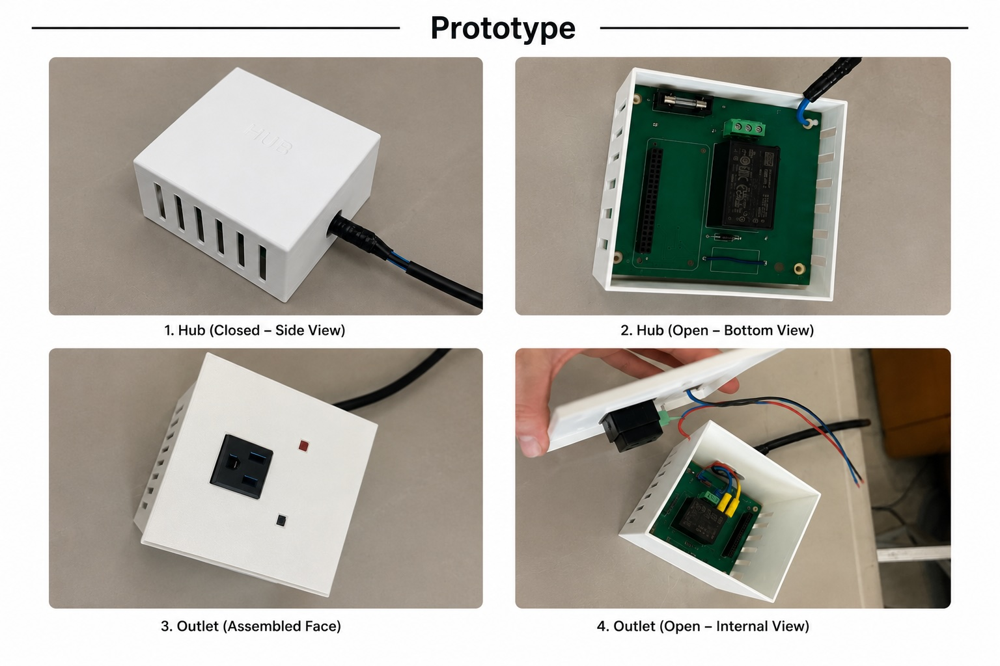

In an age of increasing digital surveillance, savvy users are looking for affordable smart home solutions that are easy to use and give them control over their data. Where most smart outlet systems plug into existing outlets [1, 2], there seems to be a hole in the market for smart outlets that integrate into the wall and report power consumption to the user, encouraging them to reduce their consumption. 

Additionally, most existing systems use mesh networks to facilitate communication between the outlets and hub [1, 2]. In some homes concrete walls, heavy appliances, wireless interference, and other issues may cause mesh networks to be unreliable. They also rely on outlets to be installed near other outlets. If the user wishes to install only a few, spread throughout the home, wireless mesh networks may prove unreliable. As an alternative, this project aims to use power-line communications (PLC) to facilitate communication between devices across an entire residential property without concern for wireless meshing [3]. 

The use of Wireguard allows the user to securely control and monitor their outlets from anywhere in the world with very little latency [4]. While peer-to-peer networking is possible for the savvy user to configure, a relay server provides an easy-to-use and reliable backup [5].

# About the Team
- **Chris James:** Electrical Engineering student at the University of Victoria. Chris led the electrical hardware development, including schematic design, PCB layout, assembly, and testing.
- **Olivia Moonie:** Computer Engineering student at the University of Victoria. Olivia developed the embedded software used to control and monitor the smart outlet system and completed project documentation.
- **Colette Reimer:** Electrical Engineering student at the University of Victoria. Colette worked on the electrical hardware design, PCB assembly and testing, and completed the enclosure design in Fusion 360.

# Design
The way that the first facet is addressed is by hosting all of the data is stored on the users device, rather than a central server, so the only person who can access the data is the user. The second facet is managed in two connected methods. The first is the system itself, acting as a smart device that allows other non-smart devices to act as Pseudo-Smart devices. The second method in which the second facet is addressed is by utilizing PLC. With this system, the consumers have freedom to decide how many of the smart outlets they want, such as a single outlet, up to an entire house. Using PLC rather than a traditional communication method like Wifi or Bluetooth, is significantly more modular. Systems that communicate via traditional methods either require individual setup, which is a pain, or a full retrofit of the outlets, to allow a mesh network to be formed. Since the PLC communicates over already existing infrastructure, and does not require a mesh network, not only can it be partially adopted, the system can also be used to connect to out-buildings, or multiple buildings on a property, as it has a significant range. 

  The prototype enclosure was designed to house the hub and outlet circuitry while providing access for wiring, ventilation, the receptacle, LED, and push button.

# Results
The project resulted in the design, assembly, and testing of a smart outlet prototype. Custom PCBs, power electronics, and 3D-printed enclosures were successfully designed and manufactured, and the hardware was evaluated through extensive testing. Although reliable Power Line Communication (PLC) between the hub and outlet was not achieved within the project timeline, the project identified key challenges and provides a strong foundation for future development.

# Acknowledgments
We would like to thank everyone who supported us throughout this project.
First, we would like to thank our project supervisor, Dr. Mihai Sima, for his guidance throughout the project. He was always willing to help when we ran into technical challenges and provided valuable advice that helped us move forward.

We would also like to sincerely thank the Department Technical Staff, Brent Sirna and Rob Fichtner, for all of their support. They spent a great deal of time helping us troubleshoot our hardware, reviewed our schematics, provided materials and equipment, and helped us repair our PCB when issues arose. Their knowledge and willingness to help played a major role in making this project possible.

We would like to thank our instructor and teaching assistant, Sana Shuja and Maryam Ahang, for their guidance, feedback, and support throughout the course. We also appreciate the support of the ECS Makerspace for providing access to the tools and facilities needed to build and test our prototype.

We would like to thank the Chair of the Electrical and Computer Engineering Department, Dr. Michael McGuire, for supporting our undergraduate capstone projects through departmental funding.
Finally, we would like to thank our family and friends for their encouragement, patience, and support throughout this project. Their encouragement helped us stay motivated from start to finish.

# References
[1]   C. Lien, Y. Bai, and M. Lin, “Remote-Controllable Power Outlet System for Home Power Management”, IEEE Transactions on Consumer Electronics, vol.53, no. 4, pp. 1634-1641, Nov. 2007, doi: 10.1109/TCE.2007.4429263.
[2]   A.S. Musleh, M. Debouza, M. Farook, “Design and implementation of smart plug: An Internet of Things (IoT) approach,” IEEE, Jan. 2018, doi: 10.1109/ICECTA.2017.8252033
[3]   P. Goyal, “Design of Power-Line Communication System (PLC) Using a PIC Microcontroller,” International Conference on Information & Communication Technology (IICT), DIT University, India, July 2007
[4]   S. Zakhary, T. Lodge, D. McAuley. “Performance Evaluation for Privacy-preserving Control of Domestic IoT Devices,” 2022. [Online]. Available: https://arxiv.org/abs/2207.08482
[5]   J. Whited. “WireGuard Endpoint Discovery and NAT Traversal using DNS-SD.” May 20, 2020. [Online]. Available: https://www.jordanwhited.com/posts/                                    wireguard-endpoint-discovery-nat-traversal/

# Links
<a href="./assets/images/Project_Poster.pdf" target="_blank">
  Project Poster
</a>

 

<a href="https://www.egbc.ca/complaints-discipline/code-of-ethics" target="_blank">
  EGBC Code of Ethics
</a>

# Code

Include code here

