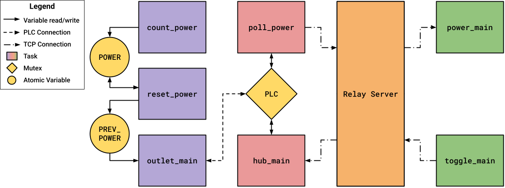

In an age of increasing digital surveillance, savvy users are looking for affordable smart home solutions that are easy to use and give them control over their data. Where most smart outlet systems plug into existing outlets [1, 2], there seems to be a hole in the market for smart outlets that integrate into the wall and report power consumption to the user, encouraging them to reduce their consumption. 

Additionally, most existing systems use mesh networks to facilitate communication between the outlets and hub [1, 2]. In some homes concrete walls, heavy appliances, wireless interference, and other issues may cause mesh networks to be unreliable. They also rely on outlets to be installed near other outlets. If the user wishes to install only a few, spread throughout the home, wireless mesh networks may prove unreliable. As an alternative, this project aims to use power-line communications (PLC) to facilitate communication between devices across an entire residential property without concern for wireless meshing [3]. 

The use of Wireguard allows the user to securely control and monitor their outlets from anywhere in the world with very little latency [4]. While peer-to-peer networking is possible for the savvy user to configure, a relay server provides an easy-to-use and reliable backup [5].

The original idea for this project came from an ECE 399 project created in fall 2024 [6].

# About the Team
- **Chris James:** Electrical Engineering student at the University of Victoria. Chris led the electrical hardware development, including schematic design, PCB layout, assembly, and testing.
- **Olivia Moonie:** Computer Engineering student at the University of Victoria. Olivia developed the embedded software used to control and monitor the smart outlet system and completed project documentation.
- **Colette Reimer:** Electrical Engineering student at the University of Victoria. Colette worked on the electrical hardware design, PCB assembly and testing, and completed the enclosure design in Fusion 360.

# Design
The outlet is responsible for toggling power to its load and measuring power consumption. It sends this data to an internet-connected hub in the home over PLC. The hub passes along power consumption data and receives toggle requests from the user over the internet. The connection is secured by Wireguard VPN. 



The prototype enclosure was designed to house the hub and outlet circuitry while providing access for wiring, ventilation, the receptacle, LED, and push button.


The circuits utilized on the PCBs were developed using the manufacturer provided circuits [7,8].

# Results
The project resulted in the design, assembly, and testing of a smart outlet prototype. Custom PCBs, power electronics, and 3D-printed enclosures were successfully designed and manufactured, and the hardware was evaluated through extensive testing. Although reliable Power Line Communication (PLC) between the hub and outlet was not achieved within the project timeline, the project identified key challenges and provides a strong foundation for future development.


# Acknowledgments
We would like to thank everyone who supported us throughout this project.
First, we would like to thank our project supervisor, Dr. Mihai Sima, for his guidance throughout the project. He was always willing to help when we ran into technical challenges and provided valuable advice that helped us move forward.

We would also like to sincerely thank the Department Technical Staff, Brent Sirna and Rob Fichtner, for all of their support. They spent a great deal of time helping us troubleshoot our hardware, reviewed our schematics, provided materials and equipment, and helped us repair our PCB when issues arose. Their knowledge and willingness to help played a major role in making this project possible.

We would like to thank our instructor and teaching assistant, Sana Shuja and Maryam Ahang, for their guidance, feedback, and support throughout the course. We also appreciate the support of the ECS Makerspace for providing access to the tools and facilities needed to build and test our prototype.

We would like to thank the Chair of the Electrical and Computer Engineering Department, Dr. Michael McGuire, for supporting our undergraduate capstone projects through departmental funding.
Finally, we would like to thank our family and friends for their encouragement, patience, and support throughout this project. Their encouragement helped us stay motivated from start to finish.

# References
[1]   C. Lien, Y. Bai, and M. Lin, “Remote-Controllable Power Outlet System for Home Power Management”, IEEE Transactions on Consumer Electronics, vol.53, no. 4, pp. 1634-1641, Nov. 2007, doi: 10.1109/TCE.2007.4429263.

[2]   A.S. Musleh, M. Debouza, M. Farook, “Design and implementation of smart plug: An Internet of Things (IoT) approach,” IEEE, Jan. 2018, doi: 10.1109/ICECTA.2017.8252033

[3]   P. Goyal, “Design of Power-Line Communication System (PLC) Using a PIC Microcontroller,” International Conference on Information & Communication Technology (IICT), DIT University, India, July 2007

[4]   S. Zakhary, T. Lodge, D. McAuley. “Performance Evaluation for Privacy-preserving Control of Domestic IoT Devices,” 2022. [Online]. Available: https://arxiv.org/abs/2207.08482

[5]   J. Whited. “WireGuard Endpoint Discovery and NAT Traversal using DNS-SD.” May 20, 2020. [Online]. Available: https://www.jordanwhited.com/posts/ wireguard-endpoint-discovery-nat-traversal/

[6]   L. Henry, C. James, A. Kervin, O. Moonie, A. Mooltazeem, “Smart Outlets for Your Home", 2024, Unpublished

[7]   TDA5051A Home automation modem, Rev. 5 (2011). NXP Semiconductors, Accessed: July 26, 2026. [Online]. Available: https://www.mouser.ca/datasheet/3/118/1/TDA5051A.pdf 

[8]   Single Phase Energy Meter IC with Integrated Oscillator for Socket, Shanghai Belling, Accessed: July 26, 2026. [Online]. Available: https://www.belling.com.cn/media/file_object/bel_product/BL0937B/datasheet/BL0937B_V1.0_en.pdf 

# Links
<a href="./assets/documents/Final_Report.pdf" target="_blank">
  Project Report
</a>

<a href="./assets/documents/Project_Poster.pdf" target="_blank">
  Project Poster
</a>

<a href="https://www.egbc.ca/complaints-discipline/code-of-ethics" target="_blank">
  EGBC Code of Ethics
</a>

# Code
Below is a list of some of the code employed by various platforms in the project.

## PLC Communications Library (platform-agnostic)
```rust
#![no_std]
#![allow(dead_code)]

use core::error::Error;
use core::fmt;
use embedded_hal::digital::{InputPin, OutputPin};
use embedded_hal_async::digital::Wait;
use embassy_time::{Duration, Ticker, Timer};
use safe_discriminant::Discriminant;

#[derive(Debug)]
pub struct ReceiveError;
impl Error for ReceiveError {}
impl fmt::Display for ReceiveError {
    fn fmt(&self, f: &mut fmt::Formatter<'_>) -> fmt::Result {
        write!(f, "Receive Error")
    }
}

#[derive(Debug)]
pub struct SendError;
impl Error for SendError {}
impl fmt::Display for SendError {
    fn fmt(&self, f: &mut fmt::Formatter<'_>) -> fmt::Result {
        write!(f, "Send Error")
    }
}

#[derive(Discriminant, Copy, Clone, Debug, PartialEq, Eq)]
#[repr(u8)]
pub enum Request {
    PollStatus(usize) = 0b_0001,
    PollPower(usize) = 0b_0010,
    Toggle(usize) = 0b_0100,
}

#[derive(Discriminant, Copy, Clone, Debug, PartialEq, Eq)]
#[repr(u8)]
pub enum Response {
    Power(usize) = 0b_0001,
    Status(bool) = 0b_0010,
}

pub struct TxPin<P: OutputPin>(pub P);
pub struct RxPin<P: InputPin>(pub P);

impl<P: OutputPin> TxPin<P> {
    pub async fn transmit<M: Message<N>, const N: usize>(
        &mut self, message: M
    ) -> Result<(), SendError> {
        let mut clk = Ticker::every(M::PERIOD);
        let message = message.pack()?;
        for byte in message {
            for i in 0..8 {
                let bit = (byte << i) & 0x80;
                if bit == 0 {
                    self.0.set_high().unwrap();
                } else {
                    self.0.set_low().unwrap();
                }
                clk.next().await;
            }
        }
        self.0.set_high().unwrap();
        Ok(())
    }
}

impl<P: InputPin> RxPin<P> {
    pub async fn receive_imm<M: Message<N>, const N: usize>(
        &mut self
    ) -> Result<M, ReceiveError> {
        Timer::after(M::DELAY).await;
        let mut clk = Ticker::every(M::PERIOD);
        let mut buffer: [u8; N] = [0; N];
        for byte in &mut buffer {
            for i in 0..8 {
                let bit = match self.0.is_low().unwrap() {
                    true => 0x80,
                    false => 0,
                };
                *byte |= bit >> i;
                clk.next().await;
            }
        }
        M::unpack(buffer)
    }
}

impl<P: InputPin + Wait> RxPin<P> {
    pub async fn receive<M: Message<N>, const N: usize>(
        &mut self
    ) -> Result<M, ReceiveError> {
        self.0.wait_for_falling_edge().await.unwrap();
        self.receive_imm().await
    }
}

pub trait Message<const N: usize>: Discriminant<Repr = u8> {
    const PERIOD: Duration = Duration::from_ticks(500);
    const DELAY: Duration = Duration::from_ticks(250);
    const BEGIN: u8;

    fn unpack_body(op: u8, body: &[u8])
        -> Result<Self, ReceiveError> where Self: Sized;
    fn pack_body(&self, body: &mut[u8])
        -> Result<(), SendError>;

    fn unpack(message: [u8; N])
        -> Result<Self, ReceiveError> where Self: Sized
    {
        if message[0] >> 4 != Self::BEGIN {
            return Err(ReceiveError);
        }
        Self::unpack_body(message[0] & 0xF, &message[1..])
    }

    fn pack(&self) -> Result<[u8; N], SendError> {
        let mut message: [u8; N] = [0; N];
        message[0] = Self::BEGIN << 4 | self.discriminant();
        self.pack_body(&mut message[1..])?;
        Ok(message)
    }

    fn to_bytes<const B: usize>(mut data: usize) -> Result<[u8; B], SendError> {
        let mut field: [u8; B] = [0; B];
        for byte in &mut field {
            let mut parity = 0;
            for i in 0..7 {
                parity ^= (data >> i) & 1;
            }
            *byte = (data as u8 & 0x7F) << 1;
            *byte |= parity as u8;
            data >>= 7;
        }
        if data == 0 {
            Ok(field)
        } else {
            Err(SendError)
        }
    }

    fn to_data(bytes: &[u8]) -> Result<usize, ReceiveError> {
        let mut data: usize = 0;
        let mut offset = 0;
        for byte in bytes {
            let mut parity = 0;
            for i in 0..7 {
                parity ^= (byte >> (i+1)) & 1;
            }
            if parity != byte & 1 {
                return Err(ReceiveError);
            }
            data |= ((byte >> 1) as usize) << offset;
            offset += 7;
        }
        Ok(data)
    }
}

impl Message<2> for Request {
    const BEGIN: u8 = 0b_1101;

    fn unpack_body(op: u8, body: &[u8]) -> Result<Self, ReceiveError> {
        match op {
            0b_0001 => Ok(Self::PollStatus(Self::to_data(body)?)),
            0b_0010 => Ok(Self::PollPower(Self::to_data(body)?)),
            0b_0100 => Ok(Self::Toggle(Self::to_data(body)?)),
            _ => Err(ReceiveError)
        }
    }

    fn pack_body(&self, body: &mut[u8]) -> Result<(), SendError> {
        match self {
            Self::PollStatus(id) => body[0] = Self::to_bytes::<1>(*id)?[0],
            Self::PollPower(id) => body[0] = Self::to_bytes::<1>(*id)?[0],
            Self::Toggle(id) => body[0] = Self::to_bytes::<1>(*id)?[0],
        };
        Ok(())
    }
}

impl Message<3> for Response {
    const BEGIN: u8 = 0b_1011;

    fn unpack_body(op: u8, body: &[u8]) -> Result<Self, ReceiveError> {
        match op {
            0b_0001 => Ok(Self::Power(Self::to_data(&body[0..2])?)),
            0b_0010 => Ok(Self::Status(body[0] == 0xFF)),
            _ => Err(ReceiveError)
        }
    }

    fn pack_body(&self, body: &mut[u8]) -> Result<(), SendError> {
        match self {
            Self::Power(power) => {
                let bytes: [u8; 2] = Self::to_bytes(*power)?;
                body[..2].copy_from_slice(&bytes);
            },
            Self::Status(status) => body[0] = if *status {0xFF} else {0x00},
        };
        Ok(())
    }
}

#[cfg(test)]
mod tests {
    use super::*;

    #[test]
    fn test_pack_request() {
        let poll_status_req = Request::PollStatus(4);
        let poll_power_req = Request::PollPower(19);
        let toggle_req = Request::Toggle(0);

        let Ok(poll_status_bytes) = poll_status_req.pack() else { panic!() };
        let Ok(poll_power_bytes) = poll_power_req.pack() else { panic!() };
        let Ok(toggle_bytes) = toggle_req.pack() else { panic!() };

        assert_eq!(poll_status_bytes, [0xD1u8, 0x09u8],
            "poll_status_req.pack() failed");
        assert_eq!(poll_power_bytes, [0xD2u8, 0x27u8],
            "poll_power_req.pack() failed");
        assert_eq!(toggle_bytes, [0xD2u8, 0x00u8], "toggle_req.pack() failed");
    }

    #[test]
    fn test_pack_request_out_of_bounds() {
        let poll_req = Request::PollStatus(128);

        assert!(poll_req.pack().is_err());
    }

    #[test]
    fn test_unpack_request() {
        let poll_status_message = [0xD1u8, 0x09u8];
        let poll_power_message = [0xD2u8, 0x27u8];
        let toggle_message = [0xD2u8, 0x00u8];

        let Ok(poll_status_req) = Request::unpack(poll_status_message)
            else { panic!() };
        let Ok(poll_power_req) = Request::unpack(poll_power_message)
            else { panic!() };
        let Ok(toggle_req) = Request::unpack(toggle_message)
            else { panic!() };

        assert_eq!(poll_status_req, Request::PollStatus(4),
            "Request::unpack(poll_message) failed");
        assert_eq!(poll_power_req, Request::PollPower(19),
            "Request::unpack(toggle_message) failed");
        assert_eq!(toggle_req, Request::Toggle(0),
            "Request::unpack(toggle_message) failed");
    }

    #[test]
    fn test_unpack_request_parity() {
        let poll_message = [0xD1u8, 0x49u8];

        assert!(Request::unpack(poll_message).is_err());
    }

    #[test]
    fn test_pack_response() {
        let power_resp = Response::Power(2037);
        let status_resp = Response::Status(true);

        let Ok(power_bytes) = power_resp.pack() else { panic!() };
        let Ok(status_bytes) = status_resp.pack() else { panic!() };

        assert_eq!(power_bytes, [0xB1u8, 0xEBu8, 0x1Eu8],
            "power_resp.pack() failed");
        assert_eq!(status_bytes, [0xB2u8, 0xFFu8, 0x00u8],
            "status_resp.pack() failed");
    }

    #[test]
    fn test_pack_response_out_of_bounds() {
        let power_resp = Response::Power(16384);

        assert!(power_resp.pack().is_err());
    }

    #[test]
    fn test_unpack_response() {
        let power_message = [0xB1u8, 0xEBu8, 0x1Eu8];
        let status_message = [0xB2u8, 0xFFu8, 0x00u8];

        let Ok(power_resp) = Response::unpack(power_message)
            else { panic!() };
        let Ok(status_resp) = Response::unpack(status_message)
            else { panic!() };

        assert_eq!(power_resp, Response::Power(2037),
            "Response::unpack(power_message) failed");
        assert_eq!(status_resp, Response::Status(true),
            "Response::unpack(status_message) failed");
    }

    #[test]
    fn test_unpack_response_parity() {
        let power_message = [0xB1u8, 0xFBu8, 0x1Eu8];

        assert!(Response::unpack(power_message).is_err());
    }
}
```

## Outlet Program (RPi Pico 2)
```rust
#![no_std]
#![no_main]

use {panic_probe as _};
use defmt_rtt as _;

use core::sync::atomic::{AtomicUsize, Ordering};

use embassy_executor::Spawner;
use embassy_rp::block::ImageDef;
use embassy_time::{Ticker, Duration, Timer};
use embassy_rp::gpio::{Input, Output, Level, Pull};
use embassy_rp::clocks::{Gpout, GpoutSrc};
use embassy_rp::Peri;
use embassy_rp::peripherals::PIN_1;
use embassy_futures::select::{select, Either};

use plc::*;

const ID: usize = 0;
const POWER_INTERVAL: Duration = Duration::from_millis(1000);
const DEBOUNCE_DELAY: Duration = Duration::from_millis(2);

static POWER: AtomicUsize = AtomicUsize::new(0);
static PREV_POWER: AtomicUsize = AtomicUsize::new(0);

// Tell the Boot ROM about the application
#[unsafe(link_section = ".start_block")]
#[used]
pub static IMAGE_DEF: ImageDef = ImageDef::secure_exe();

#[embassy_executor::task]
async fn count_power(pin: Peri<'static, PIN_1>) {
    let mut power = Input::new(pin, Pull::None);
    // let mut clk = Ticker::every(Duration::from_ticks(240));
    loop {
        power.wait_for_rising_edge().await;
        // clk.next().await;
        POWER.fetch_add(1, Ordering::Relaxed);
    }
}

#[embassy_executor::task]
async fn reset_power() {
    let mut clk = Ticker::every(POWER_INTERVAL);
    loop {
        clk.next().await;
        let power = POWER.swap(0, Ordering::Relaxed);
        PREV_POWER.store(power, Ordering::Relaxed);
    }
}

// Listen for commands from hub over PLC
#[embassy_executor::main]
async fn main(spawner: Spawner) {
    let p = embassy_rp::init(Default::default());

    // Spawn tasks
    spawner.spawn(count_power(p.PIN_1).unwrap());
    spawner.spawn(reset_power().unwrap());

    // Init GPIO
    let mut tx = TxPin(Output::new(p.PIN_22, Level::High));
    let mut rx = RxPin(Input::new(p.PIN_20, Pull::None));
    let mut led = Output::new(p.PIN_3, Level::Low);
    let mut button = Input::new(p.PIN_8, Pull::Up);

    // Init PD signal
    let _pd = Output::new(p.PIN_19, Level::Low);

    // Init TDA clock
    let tda_clk = Gpout::new(p.PIN_21);
    tda_clk.set_src(GpoutSrc::Sys);
    tda_clk.set_div(24, 0);
    tda_clk.enable();

    loop {
        // Wait for request
        match select(
            button.wait_for_falling_edge(),
            rx.receive::<Request, _>()
        ).await {
            Either::First(_) => {
                led.toggle();
                Timer::after(DEBOUNCE_DELAY).await;
            },
            Either::Second(Ok(req)) => {
                match req {
                    Request::PollStatus(id) => {
                        if id == ID {
                            let status = led.is_set_high();
                            let resp = Response::Status(status);
                            tx.transmit(resp).await.unwrap();
                        }
                    },
                    Request::PollPower(id) => {
                        if id == ID {
                            let power = PREV_POWER.load(Ordering::Relaxed);
                            let resp = Response::Power(power);
                            if tx.transmit(resp).await.is_err() {
                                let resp = Response::Power(0x3FFF);
                                tx.transmit(resp).await.unwrap();
                            }
                        }
                    },
                    Request::Toggle(id) => {
                        if id == ID {
                            led.toggle();
                        }
                    },
                }
            },
            _ => {},
        }
    }
}
```

## Hub Library (RPi Zero 2W)
```rust
#![allow(dead_code)]

use rppal::gpio::{InputPin, OutputPin};
use embassy_time::{Duration, Instant};
use embassy_sync::mutex::Mutex;
use embassy_sync::lazy_lock::LazyLock;
use embassy_sync::blocking_mutex::raw::CriticalSectionRawMutex;

use plc::*;

// Mutex-protected handle to PLC pins
pub type PlcHandle = LazyLock<Mutex::<CriticalSectionRawMutex, Plc>>;

pub struct Plc {
    pub tx: TxPin<OutputPin>,
    pub rx: TimeoutRxPin,
}

// Fetch status from outlet
pub async fn get_status(id: usize, timeout: Duration, plc: &PlcHandle) -> bool {
    let status_req = Request::PollStatus(id);
    let mut resp;
    {
        let mut plc = plc.get().lock().await;
        plc.tx.transmit(status_req).await.unwrap();
        resp = plc.rx.receive::<Response, _>(Some(timeout)).await;
    }
    while !matches!(resp, Ok(Response::Status(_))) {
        let mut plc = plc.get().lock().await;
        plc.tx.transmit(status_req).await.unwrap();
        resp = plc.rx.receive::<Response, _>(Some(timeout)).await;
    }
    let Response::Status(status) = resp.unwrap() else { panic!() };
    status
}

// Fetch power consumption from outlet
pub async fn get_power(id: usize, timeout: Duration, plc: &PlcHandle) -> usize {
    let power_req = Request::PollPower(id);
    let mut resp;
    {
        let mut plc = plc.get().lock().await;
        plc.tx.transmit(power_req).await.unwrap();
        resp = plc.rx.receive::<Response, _>(Some(timeout)).await;
    }
    while !matches!(resp, Ok(Response::Power(_))) {
        let mut plc = plc.get().lock().await;
        plc.tx.transmit(power_req).await.unwrap();
        resp = plc.rx.receive::<Response, _>(Some(timeout)).await;
    }
    let Response::Power(power) = resp.unwrap() else { panic!() };
    power
}

// Wrapper for RxPin to add timeout-capable receive
pub struct TimeoutRxPin(pub RxPin<InputPin>);

impl TimeoutRxPin {

    // Receive with timeout
    pub async fn receive<M: Message<N>, const N: usize>(
        &mut self,
        timeout: Option<Duration>
    ) -> Result<M, ReceiveError> {
        self.wait_for_falling_edge(timeout)?;
        self.receive_imm().await
    }

    async fn receive_imm<M: Message<N>, const N: usize>(
        &mut self
    ) -> Result<M, ReceiveError> {
        self.0.receive_imm().await
    }

    fn wait_for_falling_edge(
        &mut self,
        timeout: Option<Duration>
    ) -> Result<(), ReceiveError> {
        if let Some(duration) = timeout {
            let start = Instant::now();
            while self.0.0.is_high() && start.elapsed() < duration {}
            if start.elapsed() >= duration { Err(ReceiveError) } else { Ok(()) }
        } else {
            while self.0.0.is_high() {}
            Ok(())
        }
    }
}
```

## Hub Program (RPi Zero 2W)
```rust
use rppal::gpio::Gpio;
use embassy_executor::Spawner;
use embassy_time::{Timer, Ticker, Duration};
use embassy_sync::lazy_lock::LazyLock;
use embassy_sync::mutex::Mutex;
use async_net::TcpListener;
use futures_lite::prelude::*;

use plc::*;
use zero::*;

const POWER_INTERVAL: Duration = Duration::from_secs(1);
const TIMEOUT: Duration = Duration::from_micros(10000);
const TOGGLE_ADDR: &str = "192.168.2.1:15000";
const POWER_ADDR: &str = "192.168.2.1:15001";

// Get power consumption data
#[embassy_executor::task]
async fn poll_power(plc: &'static PlcHandle) {
    // Configure ticker
    let mut clk = Ticker::every(POWER_INTERVAL);

    // Configure TCP socket
    let listener = TcpListener::bind(POWER_ADDR).await.unwrap();
    let mut incoming = listener.incoming();
    let Some(new_stream) = incoming.next().await else { panic!() };
    let mut stream = new_stream.unwrap();

    loop {
        clk.next().await;

        let power = get_power(0, TIMEOUT, plc).await;

        if stream.write_all(&power.to_le_bytes()).await.is_err() {
            let Some(new_stream) = incoming.next().await else { panic!() };
            stream = new_stream.unwrap();
        }
    }
}

// Pass toggle requests on to outlet
#[embassy_executor::main]
async fn main(spawner: Spawner) {
    // Init PLC
    static PLC: PlcHandle = LazyLock::new(|| {
        let p = Gpio::new().unwrap();
        let mut pd = p.get(27).unwrap().into_output_low();
        pd.set_reset_on_drop(false);
        let _plc = Plc {
            tx: TxPin(p.get(17).unwrap().into_output_high()),
            rx: TimeoutRxPin(RxPin(p.get(18).unwrap().into_input())),
        };
        Mutex::new(_plc)
    });

    // Spawn tasks
    spawner.spawn(poll_power(&PLC).unwrap());

    // Configure TCP socket
    let listener = TcpListener::bind(TOGGLE_ADDR).await.unwrap();
    let mut incoming = listener.incoming();
    let mut buffer: [u8; 1] = [0; 1];
    let Some(new_stream) = incoming.next().await else { panic!() };
    let mut stream = new_stream.unwrap();

    loop {
        // Wait for toggle request
        while let Ok(n) = stream.read(&mut buffer).await && n == 1{
            // Fetch status
            let old_status = get_status(0, TIMEOUT, &PLC).await;

            // Send toggle requests until status changes
            let mut new_status = old_status;
            let toggle_req = Request::Toggle(0);
            while new_status == old_status {
                PLC.get().lock().await.tx.transmit(toggle_req).await.unwrap();
                Timer::after(TIMEOUT).await;
                new_status = get_status(0, TIMEOUT, &PLC).await;
            }
        }
        let Some(new_stream) = incoming.next().await else { panic!() };
        stream = new_stream.unwrap();
    }
}
```

## User Device Power Client
```rust
power/main.rs - User Device Power Client
use std::io::Read;
use std::net::TcpStream;

const POWER_ADDR: &str = "192.168.2.1:15001";

fn main() {
    // Connect to hub
    let mut stream = TcpStream::connect(POWER_ADDR).unwrap();
    println!("Connected");
    let mut buffer: [u8; 8] = [0; 8];

    // Wait for power data
    while stream.read_exact(&mut buffer).is_ok() {
        let power = u64::from_le_bytes(buffer) as f64;
        let power = power * 0.65;
        println!("Power: {:.2}W", power);
    }
}
```

## User Device Toggle Client
```rust
use std::io::Write;
use std::net::TcpStream;
use std::io::stdin;

const TOGGLE_ADDR: &str = "192.168.2.1:15000";

fn main() {
    // Connect to hub
    let mut stream = TcpStream::connect(TOGGLE_ADDR).unwrap();
    println!("Connected");

    // Wait for user to press enter key
    for _ in stdin().lines() {
        // Send toggle request
        if stream.write_all(&1_u8.to_le_bytes()).is_err() {
            break;
        }
    }
}
```
